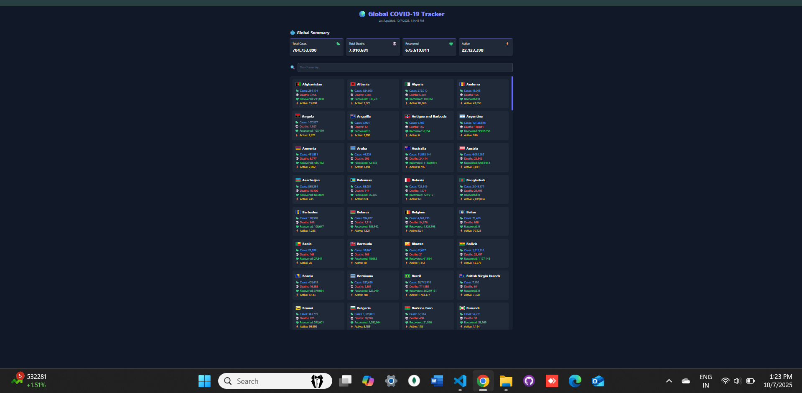
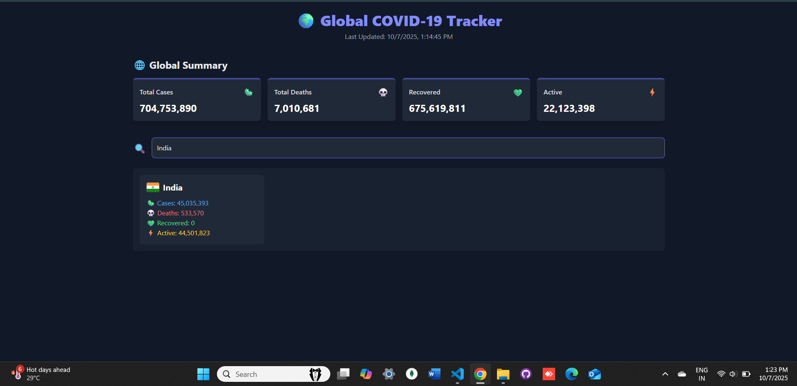

# 🌍 Global COVID-19 Tracker

A simple **Global COVID-19 Tracker** web app built using **HTML, TailwindCSS, and JavaScript**.  
It displays global statistics, allows searching for countries, and shows country-wise COVID-19 data in a clean card layout — all without external chart or icon libraries.

---

# 📌 Features

- ✅ **Global summary**: Total cases, deaths, recovered, active cases.  
- 🔍 **Search countries**: Quickly find any country and view its COVID-19 stats.  
- 🗂️ **Country list**: Displays all countries with flag, cases, deaths, recovered, and active numbers.  
- ⚡ **Lightweight & fast**: Uses only TailwindCSS and vanilla JS.  
- 💯 **No external icon or chart libraries**: Uses Unicode emojis for stats.  
- 🔄 **Real-time data**: Data fetched from [disease.sh API](https://disease.sh/).  

---

# 🛠️ Technologies Used

- **HTML5**  
- **Tailwind CSS** (for responsive and modern UI)  
- **JavaScript (Vanilla)** for fetching API data and dynamic rendering  
- **disease.sh API** for up-to-date COVID-19 data  

---

# 🔧 Setup Instructions

1. **Clone the repository**  

```bash
git clone https://github.com/<your-username>/global-covid-tracker.git
cd global-covid-tracker
Open the project
Simply open index.html in your browser.
No backend setup is required.
```

# Folder Structure

```
global-covid-tracker/
│
├── index.html        # Main HTML file
├── style.css         # Tailwind + custom styles
├── script.js         # JavaScript for fetching and rendering data
└── README.md         # Project documentation
```
# 📈 How it Works
The app fetches global stats from https://disease.sh/v3/covid-19/all.

Country-wise stats are fetched from https://disease.sh/v3/covid-19/countries.

Users can type a country name in the search bar to filter results.

All cards use Unicode emojis instead of external icon libraries.

Responsive layout thanks to TailwindCSS grids.

# ⚠️ Notes
This is a demo project for educational purposes.

Data is provided by disease.sh API.

Not intended as medical advice.

# preview 



# 👨‍💻 Author
Jinal Jain
